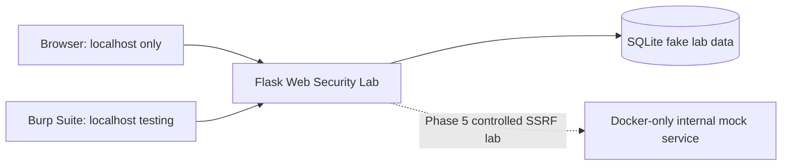

# Web Security Lab

A professional, intentionally vulnerable Flask application for learning common web vulnerabilities, detection, impact, and remediation. It is designed strictly for local, authorized security research.

> **Responsible use:** This is an educational laboratory, not a scanning or attack tool. Run it only on your own computer or an explicitly authorized environment. The service is bound to `127.0.0.1` by default, SSRF exercises will be limited to a Docker-only mock service, and all records are deterministic fake data.

## Purpose

Every completed lab will show a vulnerable implementation, controlled reproduction, root cause, secure implementation, and security lesson. Phase 1 provides the foundation; later phases enable one deliberate vulnerability at a time.

## Architecture



## Vulnerabilities

| Vulnerability | Endpoint | OWASP | Status |
| --- | --- | --- | --- |
| SQL Injection | `/search` | A03: Injection | Complete — Phase 2 |
| XSS | `/comments` | A03: Injection | Complete — Phase 3 |
| IDOR | `/profile/<user_id>` | A01: Broken Access Control | Planned — Phase 4 |
| SSRF | `/fetch` | A10: SSRF | Planned — Phase 5 |
| JWT/Auth | `/login` | A07: Authentication Failures | Planned — Phase 6 |
| File Upload | `/upload` | A04: Insecure Design | Planned — Phase 7 |
| CSRF | `/change-email` | A01: Broken Access Control | Planned — Phase 8 |

## Installation

```bash
git clone https://github.com/YOUR-USERNAME/web-security-lab.git
cd web-security-lab
python -m venv .venv
# PowerShell
.venv\Scripts\Activate.ps1
python -m pip install -r requirements.txt
python run.py
```

Or use Docker:

```bash
docker compose up --build
```

Open [http://127.0.0.1:5000](http://127.0.0.1:5000). Docker publishes only Flask on loopback; the internal mock service has no host port.

## Usage

The dashboard lists the OWASP labs. SQLite initializes with three deterministic fake users: Alice, Bob, and Carol. Completed labs include SQL Injection at `/search` and reflected/stored XSS at `/comments`, each with an intentionally vulnerable local path and a remediation comparison.

## Burp Suite

For authorized local testing, configure Burp Proxy on `127.0.0.1:8080`, point your browser at that proxy, and browse to `http://127.0.0.1:5000`. Future write-ups document a local request, response, modified parameter, observed behavior, impact, and remediation for each lab.

## Security Research and Remediation

The project follows an OWASP-oriented methodology. Each vulnerability will receive a secure counterpart and a write-up under `writeups/`. It will never include real credentials, malware, persistence, credential harvesting, destructive payloads, or external attack automation.

## Testing

```bash
python -m pytest
```

Tests cover startup, health, deterministic database initialization, SQL injection behavior, and reflected/stored XSS rendering in vulnerable and secure modes.

## Screenshots

Add dashboard and per-lab screenshots to `screenshots/` as the labs are completed.

## License

Released under the MIT License. See [LICENSE](LICENSE).
