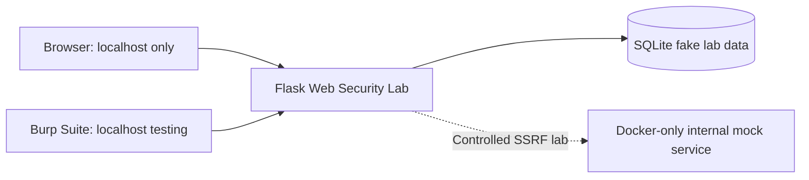

# Web Security Lab

A professional, intentionally vulnerable Flask application for learning common web vulnerabilities, detection, impact, and remediation. It is designed strictly for local, authorized security research.

> **Responsible use:** This is an educational laboratory, not a scanning or attack tool. Run it only on your own computer or an explicitly authorized environment. The service is bound to `127.0.0.1` by default, SSRF exercises are limited to a Docker-only mock service, and all records are deterministic fake data.

## Purpose

Every completed lab shows a vulnerable implementation, controlled reproduction, root cause, secure implementation, and security lesson. The project is intended to demonstrate both offensive understanding and defensive remediation rather than vulnerability exploitation alone.

## Architecture



## Vulnerabilities

| Vulnerability | Endpoint | OWASP | Status |
| --- | --- | --- | --- |
| SQL Injection | `/search` | A03: Injection | Complete — Phase 2 |
| XSS | `/comments` | A03: Injection | Complete — Phase 3 |
| IDOR | `/profile/<user_id>` | A01: Broken Access Control | Complete — Phase 4 |
| SSRF | `/fetch` | A10: SSRF | Complete — Phase 5 |
| JWT/Auth | `/login` | A07: Authentication Failures | Complete — Phase 6 |
| File Upload | `/upload` | A04: Insecure Design | Complete — Phase 7 |
| CSRF | `/change-email` | A01: Broken Access Control | Complete — Phase 8 |

## Installation

```bash
git clone https://github.com/spoukidev/web-security-lab.git
cd web-security-lab
python -m venv .venv
# PowerShell
.venv\Scripts\Activate.ps1
python -m pip install -r requirements.txt
python run.py
```

Or use Docker:

```bash
docker compose up --build
```

Open `http://127.0.0.1:5000`. Docker publishes only Flask on loopback; the internal mock service has no host port.

## Usage

The dashboard lists the OWASP labs. SQLite initializes with three deterministic fake users: Alice, Bob, and Carol. All seven planned labs are complete, each with an intentionally vulnerable local path and a remediation comparison.

## Burp Suite

For authorized local testing, configure Burp Proxy on `127.0.0.1:8080`, point your browser at that proxy, and browse to `http://127.0.0.1:5000`. Write-ups should document the local request, response, modified parameter, observed behavior, impact, root cause, and remediation.

## Security Research Methodology

For every vulnerability, the lab aims to document:

1. The vulnerable code path.
2. A controlled local reproduction.
3. The security impact.
4. The underlying root cause.
5. A secure implementation.
6. Regression tests that distinguish vulnerable and secure behavior.

This makes the repository useful as both an application-security laboratory and a defensive engineering portfolio project.

## Testing

```bash
python -m pytest
```

Tests cover startup, health, deterministic database initialization, and vulnerable-versus-secure behavior for SQL injection, XSS, IDOR, SSRF, JWT validation, file upload, and CSRF protection.

## Screenshots and Research Extensions

Add dashboard and lab screenshots to `screenshots/` after exercising the local instance. Future extensions can add more fake-data scenarios, expanded local request/response evidence, and additional OWASP mappings without widening the lab’s scope.

## Safety Boundaries

The repository does not include real credentials, malware, persistence, credential harvesting, destructive payloads, or external attack automation. All exercises are intended for local or explicitly authorized environments.

See [SECURITY.md](SECURITY.md) and the [final security review](docs/phase-9-security-review.md) for scope boundaries and the final audit.

## License

Released under the MIT License. See [LICENSE](LICENSE).
